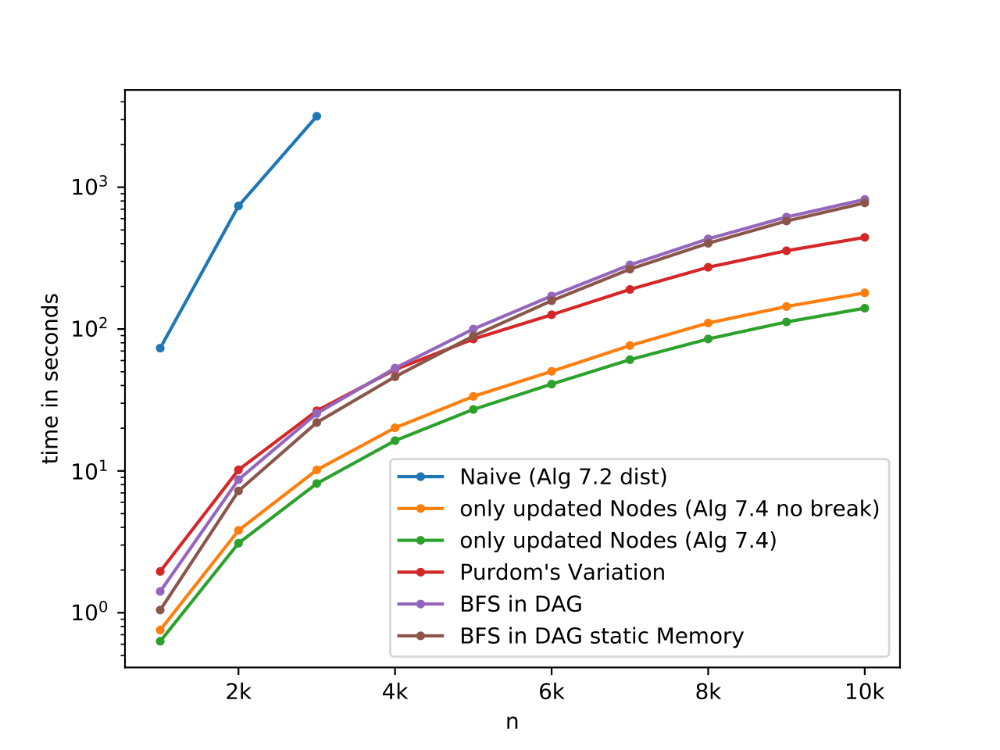

# C++ Library

Just look for yourself. It's only four files.
Or keep reading.
The two classes (``Graph``, ``Network``) are explained below.

Headers in ``./include/``.

Sources in ``./source/``

## Graph

A graph implementation with many modified and efficient BFS implementations.

- undirected graph modelled as a directed graph in a adjacency list
- vertices are identified by a zero based index in \[0, size)
- static methods prefixed with ``create`` return special instances
- otherwise use the constructor ``Graph::Graph(int size)`` and connect vertices with ``Graph::connect(int u, int v)``

## Network

The ``Network`` class represents our implementation of the local add-only game (LAOG).
It uses the ``Graph`` class to represent the current action-profile.

Customization:
- in constructor
    - initial network (including a name)
    - distance cost function (by choice of BR implementation)
    - link cost function
- via public member
    - greedy
    - constants of link cost
    - seed (member function)
- other
    - scheduling can be changed per round

Run Simulation:
- call ``performRound`` until it returns ``true``

Obtain Results:
- write graph to file (``.dot`` or ``_<round>.gexf``)
    - ``.dot`` file contains detailed meta information in header
- filename can be checked with ``Network::filename()``
- round accessable as public member
- converged flag accessable as public member

We provide an executable that does all this stuff with reasonable defaults (our CLI).
The command line client exposes nearly all functionality of the ``Network`` class.

## Tests [](https://travis-ci.org/chistopher/LAOG)


The tests are implemented as two executables.

- ``./scripts/test_Graph.cpp``
- ``./scripts/test_Network.cpp``

A successful run of all tests outputs ``all tests passed``.
The only output if a test fails is ``assertion failed``.
Detailed information is meant to be obtained with a debugger.

The CI builds **all** executables and runs the tests for
- OSX and AppleClang 9.0
- Ubuntu and GCC 5.5
- Ubuntu and Clang 5.0

## Dependencies

- C++11
- CMake 3.2 or higher
- OS: Ubuntu, Windows, or OSX (others at your own risk)

## Build Instructions
The following bash commands will build all executables (CLI, Tests, Benchmark, etc.) in the subdirectory ``./build/``:
```
> cd ${projectFolder}
> mkdir build
> cd build
> cmake -DCMAKE_BUILD_TYPE=Release ..
> make -j 4
```

On Windows we recommend using one of the following setups
- the CMake GUI and Visual Studio
- CLion's integrated CMake support and GCC on MinGW
- the Windows Subsystem for Linux (WSL) with Ubuntu 16.04 or 18.04 and GCC or Clang

All six configurations for Windows were observed to work.


# Command-Line Client

The CLI is the recommended starting point if you want to explore the functionality of this repository.
It is implemented in ``./scripts/laogen.cpp``.
The executable will be called ``./build/laogen`` when built with the commands stated above.

Parameters and usage of the CLI are provided by the executable.
Try out the help parameter! The output should look something like
```
> ./build/laogen --help
usage: ./laogen [-n anInt]                // number of nodes               default 1000
                [-dist dist|two]          // distance cost function        default two
                [-cost linear|poly]       // edge cost function            default linear
                [-a aFloat]               // factor or exponent for cost   default 0.4
                [-c aFloat]               // constant offset for edge cost default 0.0
                [-start circle|tree|path] // starting graph configuration  default circle
                [-greedy 0|1]             // best response or greedy       default 0
                [-random 0|1]             // enables random scheduling     default 1
                [-seed anInt]             // seed for scheduling and tree  default 1337
                [-gexf 0|1]               // save intermediates as gexf    default 0
                [-file aString]           // file name for output graph    default a good one
```

# Test Series Scripts

The test series generation scripts require a compiled version of the CLI to generate the graphs.
Pass it as the first and only argument to the bash script.
The SLURM script takes no arguments, but expects the executable in the working directory. 
A precompiled executable of the CLI for current Unix systems can be found at ``./fsoc/laogen``.
It is statically linked against the LAOG-Library, the C standard library, and the C++ standard library.
Since the pseudo-randomness of our implementation is not cross-plattform, we strongly recommend to use and archive a static executable (or just use our precompiled one).


## File Structure

The scripts generate a folder named after the most important configuration parameters in the CWD (e.g. `dist_linear_1.0_0.0_tree`).
An instance is named after the size of the network and the index of the run (e.g. ``1000_3``).
For each instance we save a ``.log`` and a ``.dot`` file.
The logs can be inspected live.
This is especially helpful when investigating the progress of a long computation on a SLURM computing cluster.
More useful bash commands for SLURM are defined in ``./fsoc/info_commands``.


## Generation Scripts

- SLURM (``./fsoc/gen_over_n.sh``)
- parallel Bash (``./gen_over_n.sh``)

Example:
```
> ./gen_over_n.sh build/laogen
starting two_linear_0.46_0.0_circle/1000_0
starting two_linear_0.46_0.0_circle/1000_1
starting two_linear_0.46_0.0_circle/1500_0
starting two_linear_0.46_0.0_circle/1500_1
finished two_linear_0.46_0.0_circle/1000_1
finished two_linear_0.46_0.0_circle/1000_0
finished two_linear_0.46_0.0_circle/1500_1
finished two_linear_0.46_0.0_circle/1500_0

> ls two_linear_0.46_0.0_circle
1000_0.dot  1000_0.log  1000_1.dot  1000_1.log
1500_0.dot  1500_0.log  1500_1.dot  1500_1.log

> cat two_linear_0.46_0.0_circle/1000_0.log
Wed Sep  5 17:48:22 DST 2018
starting round 1
starting round 2
... more rounds ...
starting round 17
network converged in 16 round(s)
Wed Sep  5 17:48:23 DST 2018

> cat two_linear_0.46_0.0_circle/1000_0.dot | grep -m 20 .
/* META INFO:
round      16
converged  1
seed       1000
n          1000
m          6930
start      circle
dist       two
cost       linear
a          0.46
c          0
greedy     0
random     1
*/
graph graphname {
0 -- 1;
0 -- 999;
0 -- 2;
0 -- 5;
0 -- 32;
```

## Plotting and Analyzing

Analyzing a series of generates graphs is done with the scripts in ``./plot_metrics/``.
The powerlaw package may print one or two arithmetical warnings while it tries to find the best fit.
This is totally normal and is explained by their developer in [this issue](https://github.com/jeffalstott/powerlaw/issues/25).

Our scripts cache the results for each graph and analyzed folder.
You can cancel and restart the script at any time.
- the metrics per ``<size>_<run>.dot`` are saved in ``<size>_<run>.json`` because they take hella long to compute even with C++ based graph-tool package
- the metrics per analyzed folder are cached in a ``metrics.json`` to allow quick feedback when changing the plotting code

Example:
```
> ./plot_metrics/main.py dist_linear_1.0_0.0_tree
... this may take a while but we show a bunch of logging ...

> ls dist_linear_1.0_0.0_tree | grep .pdf
plot_KS.pdf
plot_avg_degree.pdf
plot_edges.pdf
plot_exponent.pdf
plot_global_clustering.pdf
plot_local_clustering.pdf
plot_max_degree.pdf
plot_min_degree.pdf
plot_pseudo_diameter.pdf
plot_rounds.pdf
plot_x_min.pdf
```

Quick information for one specific graph can be obtained with the ``print_info.py`` script.
First argument is a ``.dot`` file.
If an optional second argument is supplied, the script generates PDF, CDF, and CCDF for the degree distribution of the input graph.
The files share the base name with the supplied ``.dot`` and append ``_[pdf|cdf|ccdf].pdf``.
Uncomment two lines in the script to compute diameter and clustering. This has a high performance impact and becomes nearly intractable for n>10k.

Example:
```
> ./print_info.py dist_linear_1.0_0.0_tree/1000_0.dot 911insidejob
nodes                 1000
edges                 5901
max degree            483
power law exponent    2.559815003231789
xmin                  12.0
%nodes under xmin     82.4
KS distance           0.033548525259639694
compare with exponential distribution ...
loglikelihood ratio   71.78735031643004
p-value               0.0003120390354296745

> ls dist_linear_1.0_0.0_tree | grep 1000_0
1000_0.dot
(1000_0.json) // if already analyzed
1000_0.log
1000_0_ccdf.pdf
1000_0_cdf.pdf
1000_0_pdf.pdf
```

## Dependencies

The following python packages are needed for the ``./plot_metrics/`` scripts:
- powerlaw
- matplotlib
- (mpmath)
- [graph-tool](https://graph-tool.skewed.de/) (requires a C++ implementation)

The following python packages are needed for the ``./print_info.py`` script:
- powerlaw
- networkx
- numpy
- matplotlib
- (mpmath)

# Misc Apps

Each file in the ``./scripts/`` folder produces an independent executable.
All executable link against the LOAG C++ Library.
Static or dynamic linking (including the C and C++ libs) can be switched by uncommenting some (ca. 2) lines in the ``./CMakeLists.txt``

## link triple

In response to the Davidsen, Ebel, Bornholdt [[Davidsen et al., 2002]](https://journals.aps.org/prl/abstract/10.1103/PhysRevLett.88.128701) model,
[[Vázquez, 2003]](https://journals.aps.org/pre/abstract/10.1103/PhysRevE.67.056104) shows that linking neighbors results in a power law degree distribution.
They propose a simple model to verify their analytical results empirically (Section IV).
We were unable to produce the same results and would be grateful for any assistance.
Our implementation can be found at ``./scripts/link-triple.cpp``.

## testing

An executable to test WIP features of the C++ Library.
Edit as you see fit.

## benchmark

Executable to benchmak all implementations of the BR computation.
We produced neat plots with the stuff provided in the ``./benchmark/`` folder (script, static executable, logs, and final plots).

Example:
```
> ./build/benchmark
first arg no valid bestResponse function
    0 neighNaive
    1 neighCurrent
    2 neighUnrolled
    3 distNaive
    4 distImproOfEdge
    5 distImproOfEdgeMaxLayer
    6 distWithSets
    7 distDAGandBFS
    8 distDAGandBFSStatic

> ./build/benchmark 4
using   distImproOfEdge
tree    1
alpha   1
reps    50
n       200 400 600 800 1000 2000 3000 4000 5000 6000 7000 8000 9000 10000
12
63
600/13  rounds: 6       in 180 ms
... again, this may take some time ...
```

